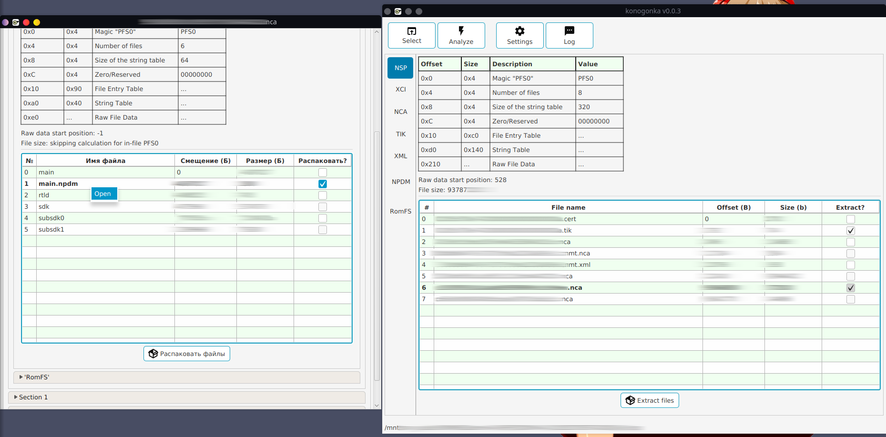
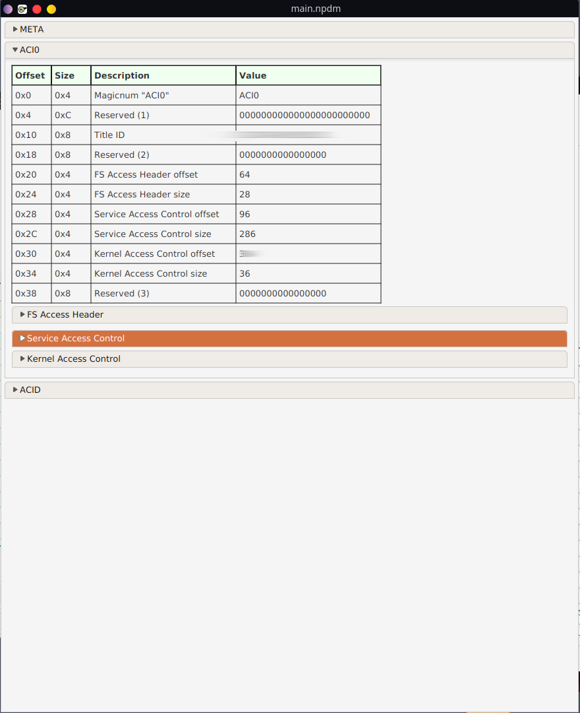
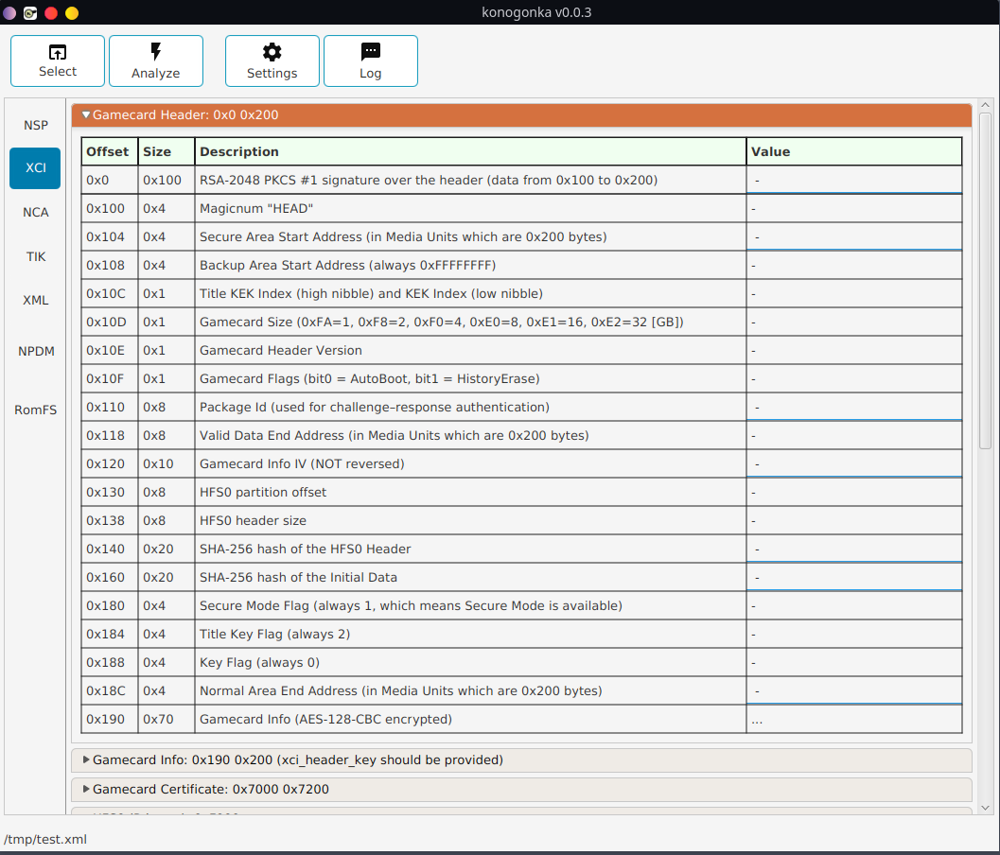
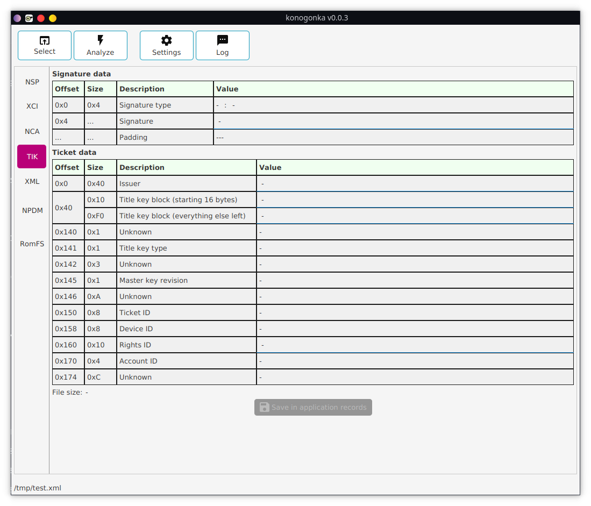
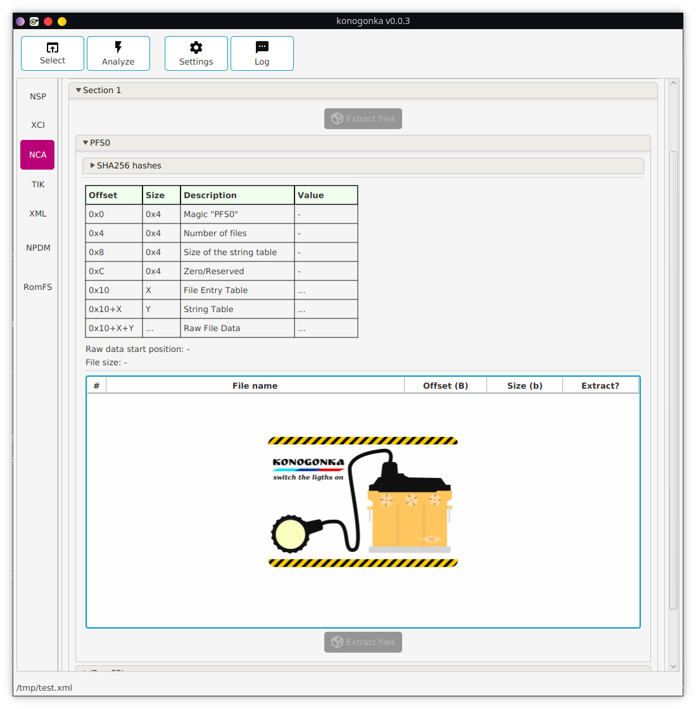
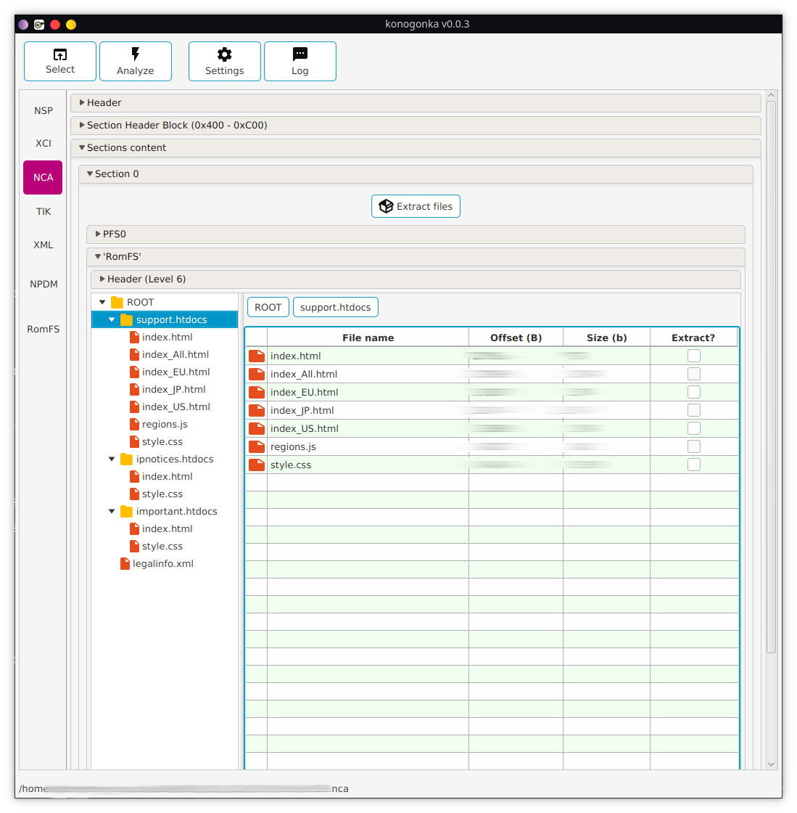

# konogonka

GitHub mirror. [Click here to get it from independent source code location](https://git.redrise.ru/desu/konogonka) 

Nightly builds could be found somewhere on [redrise.ru](https://redrise.ru)

Deep WIP multi-tool to work with NS-specific files / filesystem images.

Front end to libKonogonka

### License

[GNU General Public License v3+](https://github.com/developersu/konogonka/blob/master/LICENSE)

  

  

### Used libraries & resources
* [OpenJFX](https://wiki.openjdk.java.net/display/OpenJFX/Main)
* Few icons taken from: [materialdesignicons.com](http://materialdesignicons.com/)
* See libKonogonka project for details

### System requirements

JRE/JDK 8u60 or higher.

### Notes about usage

1. Start from clicking on 'settings' and importing keys. Use import. Don't waste your time.
2. To open sub-file from the file use right mouse click and select 'Open'. Supported formats listed below.

### Build this

1. Install JDK
2. Install Maven
3. Install libKonogonka to local repository:
4. $ git clone https://git.redrise.ru/desu/libKonogonka
5. $ mvn -B -DskipTests clean package
6. $ mvn install:install-file -Dfile=./target/libKonogonka-*-jar-with-dependencies.jar -DgroupId=ru.redrise -DartifactId=libKonogonka -Dversion=`grep -m 1 '<version>' pom.xml| sed -e 's/\s*.\/\?version>//g'
   ` -Dpackaging=jar -DgeneratePom=true;
7. $ git clone https://github.com/developersu/konogonka.git
8. $ mvn -B -DskipTests clean package
9. $ java -jar target/konogonka-0.x.x-jar-with-dependencies.jar

### Checklist

* [x] NSP (PFS0)
* [x] XCI (+HFS0)
* [x] TIK
* [x] XML 
* [x] NRO
* [x] NPDM support (to check)
* [ ] CERT support
* [ ] CNMT support
* [ ] NSO support
* [x] RomFS
* [ ] LogPrinter to singleton implementation. 
* [x] 'Save to folder' option